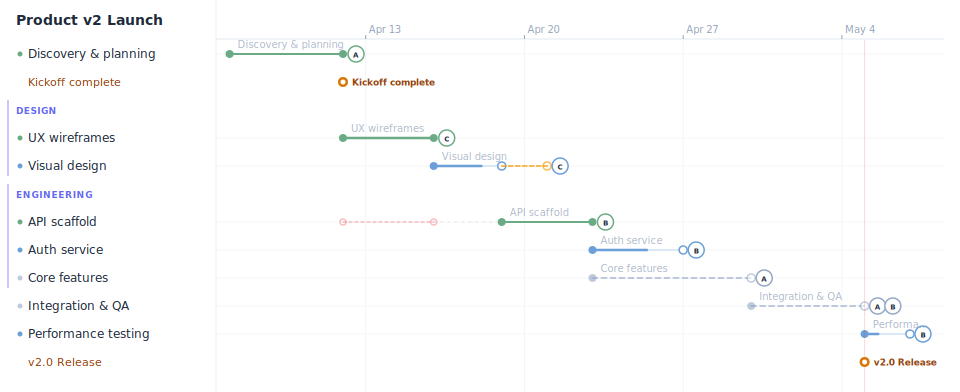

# YATT — Yet Another Task Tracker

Plain-text Gantt charts that live inside Markdown. Sequential tasks by default, named parallel blocks, pipe-delimited fields, explicit `after:` dependencies — all in one line per task.

  [](https://angshuman.github.io/yatt/)

---



~~~yatt
title: Product v2 Launch
start: 2026-01-05

[done]   Discovery & planning  | 5d  | @alice          | id:phase1
>> Kickoff complete      | after:phase1

parallel: design | after:phase1
[done]   UX wireframes         | 4d  | @carol  | %100
[=] Visual design | 3d | @carol | %99 | +delayed:2d
end: design

parallel: engineering | after:phase1
[done]   API scaffold          | 3d  | @bob              | id:api
[!] Auth service | 4d | @bob | %45 | after:api
[?]      Core features         | 1w  | @alice  | +delayed:1w | after:api
end: engineering

[!] Integration & QA | id:qa | 5d | @alice @bob | after:design,engineering
// hello
[!]      Performance testing   | 2d  | @bob             | after:qa
>> v2.0 Release                | after:qa               | +deadline
~~~

**What this demonstrates:**
- `[done]` `[active]` `[?]` `[!]` `[new]` — task statuses with distinct colours
- `parallel: name` — two workstreams running concurrently from the same anchor
- `after:phase1` / `after:design,engineering` — explicit AND dependencies
- `+delayed:2d` / `+delayed:1w` — shifts actual bar forward; **orange** ghost bar shows original planned position
- `+blocked:X` — same time-shift but semantically external; **red** ghost bar
- `after:design,engineering` — `design` and `engineering` are the parallel block names (their implicit IDs)
- `>> milestone` — diamond markers; `+deadline` draws a full-height hairline
- `%60` progress fill inside bars · `@assignee` initials on bars
- Today line drawn automatically

---

## Quick start

**Try it live:** [angshuman.github.io/yatt](https://angshuman.github.io/yatt/)

```bash
npm install yatt
```

```js
import { render } from 'yatt'

const { html, errors } = render(source, 'gantt')
// html is a self-contained <svg> string
```

Or drop a `yatt` fence in any Markdown file:

~~~md
```yatt
title: My Project
start: 2026-03-01

[done]   Research   | 3d | @alice | id:r
[active] Build      | 1w | @bob   | after:r | %40
[new]    Ship it    | 1d | @alice | after:build
>> Launch           | after:ship-it | +deadline
```
~~~

## Key concepts

| Concept | Syntax | Notes |
|---|---|---|
| Sequential (default) | just write tasks top-to-bottom | each starts when the previous ends |
| Parallel block | `parallel: name` … `end: name` | all run from the same anchor; don't advance it |
| Named dependency | `id:slug` on source, `after:slug` on dependent | doc-global; works across blocks |
| AND dependency | `after:a,b` | starts after both complete |
| OR dependency | `after:a\|b` | starts after either completes |
| Business days | `5bd` or header `schedule: business-days` | skips Sat/Sun |
| Subtasks | leading `.` or `..` | sequential within parent |
| Task description | `//` line(s) immediately after a task | attached as tooltip/annotation; blank line breaks attachment |
| Time-shift (slip) | `+delayed:3d` | shifts bar forward; orange ghost shows original |
| Time-shift (external block) | `+blocked:2w` | same shift; red ghost shows original |

## Status symbols

Both forms are accepted:

| Sigil | Word | Colour |
|---|---|---|
| `[x]` | `[done]` | green |
| `[~]` | `[active]` | blue |
| `[ ]` | `[new]` | slate |
| `[!]` | `[blocked]` | red + stripes |
| `[?]` | `[at-risk]` | amber |
| `[>]` | `[deferred]` | purple (skipped in chain) |
| `[_]` | `[cancelled]` | grey + strikethrough |
| `[=]` | `[review]` | violet |
| `[o]` | `[paused]` | slate-dark |

## Documentation

- [SPEC.md](./SPEC.md) — Full language specification with formal grammar
- [docs/syntax.md](./docs/syntax.md) — Tutorial-style guide, learn by example
- [docs/integrations.md](./docs/integrations.md) — VS Code, Obsidian, Remark, Browser

## Integrations

| Environment | How | Source |
|---|---|---|
| **VS Code** | Extension — renders `yatt` fences in Markdown preview live | [integrations/vscode/](./integrations/vscode/) |
| **Obsidian** | Community plugin — live preview in notes | [integrations/obsidian/](./integrations/obsidian/) |
| **Remark / MDX** | `remarkYatt` plugin for Docusaurus, Next.js, Astro | [integrations/remark/](./integrations/remark/) |
| **Browser** | Standalone `<script>` tag, zero framework | [integrations/browser/](./integrations/browser/) |

## Examples

| File | Description |
|---|---|
| [01-hello-world.md](./examples/01-hello-world.md) | Simplest possible chart — sequential tasks with descriptions |
| [02-team-sprint.md](./examples/02-team-sprint.md) | Sprint planning with statuses, assignees, priorities, and dependencies |
| [03-product-launch.md](./examples/03-product-launch.md) | Phased launch with milestones, subtasks, and cross-phase dependencies |
| [04-parallel-workstreams.md](./examples/04-parallel-workstreams.md) | Multiple independent workstreams converging on shared milestones |
| [05-enterprise-program.md](./examples/05-enterprise-program.md) | Full-scale program — all features combined |
| [06-delays-and-blocks.md](./examples/06-delays-and-blocks.md) | `+delayed:X` and `+blocked:X` with ghost bars |
| [software-release.yatt](./examples/software-release.yatt) | Multi-team platform v3.0 release |
| [personal-project.yatt](./examples/personal-project.yatt) | Solo dev portfolio redesign |
| [construction.yatt](./examples/construction.yatt) | Commercial fit-out — `bd` durations, `+external`, regulatory milestones |

## License

MIT
